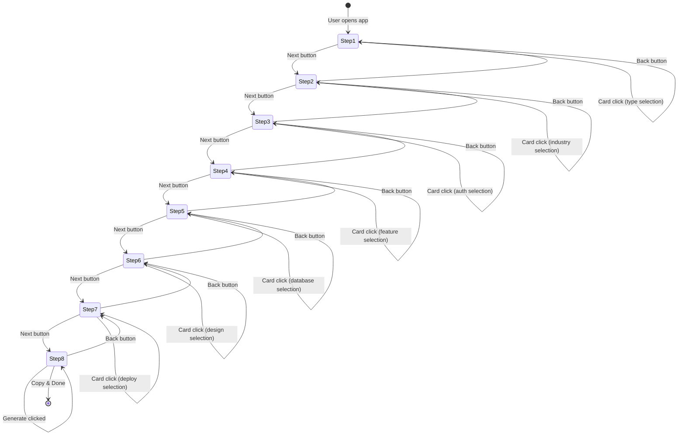

# Blueprint Prompt Generator - Architecture

## 1. Project Structure

```
promptgen/
├── app/
│   ├── layout.tsx                 # Root layout (Dark mode provider, fonts)
│   ├── page.tsx                   # Main wizard page
│   ├── globals.css                # Tailwind + CSS variables
│   └── providers.tsx             # Client-side providers wrapper
├── components/
│   ├── ui/                        # Shadcn UI primitives
│   │   ├── button.tsx
│   │   ├── card.tsx
│   │   ├── textarea.tsx
│   │   └── tooltip.tsx
│   ├── wizard/
│   │   ├── wizard-shell.tsx       # Main wizard container
│   │   ├── stepper.tsx           # Progress indicator (1-8)
│   │   ├── step-content.tsx      # Dynamic step renderer
│   │   ├── steps/
│   │   │   ├── type-step.tsx      # Step 1: Project Type
│   │   │   ├── industry-step.tsx  # Step 2: Industry
│   │   │   ├── auth-step.tsx      # Step 3: Authentication
│   │   │   ├── features-step.tsx  # Step 4: Features
│   │   │   ├── database-step.tsx  # Step 5: Database
│   │   │   ├── design-step.tsx    # Step 6: Design
│   │   │   ├── deploy-step.tsx    # Step 7: Deploy
│   │   │   └── ai-step.tsx        # Step 8: AI Output
│   │   └── wizard-footer.tsx      # Navigation buttons
│   └── selectable-card.tsx        # Reusable card component
├── store/
│   └── useWizardStore.ts          # Zustand global state
├── utils/
│   ├── dictionary.ts              # UI value → instruction mappings
│   └── markdown-generator.ts       # Template literal engine
├── types/
│   └── wizard.ts                  # TypeScript interfaces
└── lib/
    └── utils.ts                   # Shadcn cn() utility
```

---

## 2. State Flow Diagram

```
┌─────────────────────────────────────────────────────────────────────┐
│                        USER INTERACTIONS                             │
└─────────────────────────────────────────────────────────────────────┘
                                  │
                                  ▼
┌─────────────────────────────────────────────────────────────────────┐
│                      SelectableCard Click                           │
│  ┌──────────────┐    ┌──────────────┐    ┌──────────────────────┐  │
│  │   SINGLE     │    │   MULTIPLE   │    │   OPTIONAL TEXT      │  │
│  │   mode       │    │   mode       │    │   input              │  │
│  └──────────────┘    └──────────────┘    └──────────────────────┘  │
└─────────────────────────────────────────────────────────────────────┘
                                  │
                                  ▼
┌─────────────────────────────────────────────────────────────────────┐
│                    Zustand Wizard Store                             │
│  ┌─────────────────────────────────────────────────────────────┐   │
│  │  selections: {                                              │   │
│  │    type: "web-app" | "api" | "mobile" | ...,                 │   │
│  │    industry: "fintech" | "healthcare" | ...,                │   │
│  │    auth: { method: "jwt" | "oauth", providers: [...] },     │   │
│  │    features: ["dashboard", "analytics", ...],               │   │
│  │    database: { primary: "postgres", orm: "prisma" },        │   │
│  │    design: { style: "rounded" | "minimal", ... },           │   │
│  │    deploy: { platform: "vercel" | "aws", ... },             │   │
│  │    ai: { provider: "openai" | "anthropic", ... }            │   │
│  │  }                                                          │   │
│  └─────────────────────────────────────────────────────────────┘   │
└─────────────────────────────────────────────────────────────────────┘
                                  │
                    ┌─────────────┴─────────────┐
                    ▼                           ▼
┌───────────────────────────────┐   ┌───────────────────────────────┐
│      Wizard Navigation        │   │    Step Components (1-7)      │
│  nextStep() / prevStep()      │   │    Read-only state access      │
│  currentStep: number          │   │    Display only                │
└───────────────────────────────┘   └───────────────────────────────┘
                                            │
                                            ▼
┌─────────────────────────────────────────────────────────────────────┐
│                      Step 8: AI Step                                │
│  ┌─────────────────────────────────────────────────────────────┐   │
│  │  generatePrompt() → markdownGenerator(state, dictionary)     │   │
│  └─────────────────────────────────────────────────────────────┘   │
└─────────────────────────────────────────────────────────────────────┘
                                            │
                                            ▼
┌─────────────────────────────────────────────────────────────────────┐
│                    Output Panel                                     │
│  ┌─────────────────────────────────────────────────────────────┐   │
│  │  <textarea readOnly value={generatedPrompt} />              │   │
│  │  <button onClick={copyToClipboard}>Copy</button>             │   │
│  └─────────────────────────────────────────────────────────────┘   │
└─────────────────────────────────────────────────────────────────────┘
```

---

## 3. Data Flow (Step-by-Step)

### 3.1 User Selection Flow
```
User clicks card
    ↓
SelectableCard onSelect(id) fires
    ↓
Parent Step component calls updateSelection()
    ↓
Zustand store updates selections object (immutable)
    ↓
All subscribed components re-render
```

### 3.2 Markdown Generation Flow
```
User clicks "Generate Prompt" on Step 8
    ↓
generatePrompt() called in store
    ↓
Template literal in markdown-generator.ts
    ↓
Dictionary lookups for each selection
    ↓
Full Markdown string assembled
    ↓
generatedPrompt state updated
    ↓
Textarea displays result
```

---

## 4. Component Communication

```
┌─────────────────────────────────────────────────────────────────────┐
│                         WizardShell                                 │
│  ┌─────────────────────────────────────────────────────────────┐   │
│  │  Renders StepContent based on currentStep from store       │   │
│  │  Passes down: onUpdate, selections, currentStep             │   │
│  └─────────────────────────────────────────────────────────────┘   │
└─────────────────────────────────────────────────────────────────────┘
                                  │
        ┌─────────────────────────┼─────────────────────────┐
        ▼                         ▼                         ▼
┌───────────────┐       ┌───────────────┐       ┌───────────────┐
│  Selectable   │       │  Selectable   │       │  Selectable   │
│    Card       │       │    Card       │       │    Card       │
│  (Single)     │       │  (Multiple)   │       │  (Multiple)   │
└───────────────┘       └───────────────┘       └───────────────┘
        │                         │                         │
        └─────────────────────────┼─────────────────────────┘
                                  ▼
┌─────────────────────────────────────────────────────────────────────┐
│                    Step Component (e.g., FeaturesStep)              │
│  ┌─────────────────────────────────────────────────────────────┐   │
│  │  onSelect={(id) => updateSelection('features', id)}         │   │
│  │  onOptionalText={(text) => updateSelection('featuresText', text)} │
│  └─────────────────────────────────────────────────────────────┘   │
└─────────────────────────────────────────────────────────────────────┘
```

---

## 5. Mermaid State Diagram



---

## 6. File Responsibilities

| File | Responsibility |
|------|----------------|
| `useWizardStore.ts` | Global state, selections, navigation, generation trigger |
| `dictionary.ts` | Maps UI values to detailed AI instruction strings |
| `markdown-generator.ts` | Template literal function to build Markdown |
| `wizard-shell.tsx` | Layout, stepper, dynamic step rendering |
| `selectable-card.tsx` | Reusable card with single/multiple selection modes |
| `step-*.tsx` | Individual step UI, calls store updates |
| `types/wizard.ts` | All TypeScript interfaces and types |
