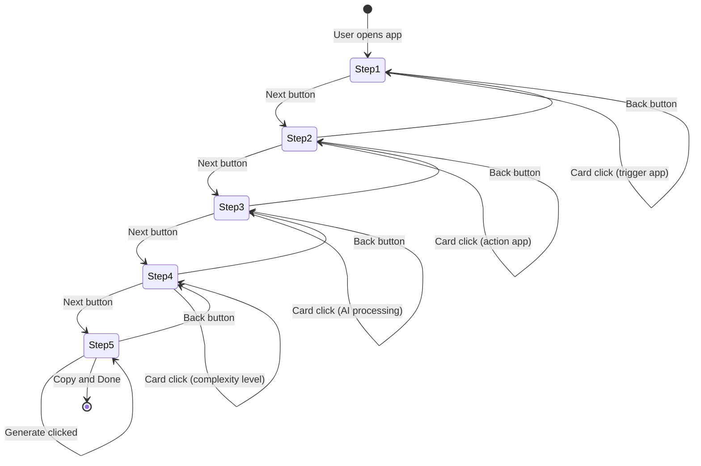

# AI Automation Workflow Generator - Architecture

## 1. Project Structure

```
src/features/ai-automation/
├── steps/
│   ├── trigger-app-step.tsx       # Step 1: Trigger App selection
│   ├── action-app-step.tsx        # Step 2: Action App selection
│   ├── ai-processing-step.tsx     # Step 3: AI Processing selection
│   ├── complexity-level-step.tsx  # Step 4: Complexity Level selection
│   └── output-step.tsx            # Step 5: Output/Generate
├── store/
│   └── useWizardStore.ts          # Zustand global state
├── types/
│   └── wizard.ts                  # TypeScript interfaces
└── utils/
    ├── dictionary.ts              # UI value to instruction mappings
    └── markdown-generator.ts      # Template literal engine
```

---

## 2. State Flow Diagram

```
                            USER INTERACTIONS
                                  |
                                  v
                      SelectableCard Click
            SINGLE               MULTIPLE           OPTIONAL TEXT
            mode                 mode               input
                                  |
                                  v
                    Zustand Wizard Store
  selections: {
    triggerApp: "webhook" | "gmail" | "typeform" | ...,
    actionApp: "google-sheets" | "notion" | "slack" | ...,
    aiProcessing: "summarize" | "extract-json" | ...,
    complexityLevel: "simple-linear" | "advanced-routers"
  }
                                  |
                    +-------------+-------------+
                    v                           v
      Wizard Navigation            Step Components (1-4)
  nextStep() / prevStep()          Read-only state access
  currentStep: number              Display only
                                              |
                                              v
                          Step 5: Output Step
              generatePrompt() -> markdownGenerator(state, dictionary)
                                              |
                                              v
                              Output Panel
              <textarea readOnly value={generatedPrompt} />
              <button onClick={copyToClipboard}>Copy</button>
```

---

## 3. Data Flow (Step-by-Step)

### 3.1 User Selection Flow
```
User clicks card
    v
SelectableCard onSelect(id) fires
    v
Parent Step component calls updateSelection()
    v
Zustand store updates selections object (immutable)
    v
All subscribed components re-render
```

### 3.2 Markdown Generation Flow
```
User clicks "Generate Prompt" on Step 5
    v
generatePrompt() called in store
    v
Template literal in markdown-generator.ts
    v
Dictionary lookups for each selection
    v
Full Markdown string assembled
    v
generatedPrompt state updated
    v
Textarea displays result
```

---

## 4. Component Communication

```
+-------------------------------------------------------+
|                     WizardShell                        |
|  Renders StepContent based on currentStep from store  |
|  Passes down: onUpdate, selections, currentStep       |
+-------------------------------------------------------+
          |                    |                    |
          v                    v                    v
  +---------------+    +---------------+    +---------------+
  |  Selectable   |    |  Selectable   |    |  Selectable   |
  |    Card       |    |    Card       |    |    Card       |
  |  (Single)     |    |  (Multiple)   |    |  (Multiple)   |
  +---------------+    +---------------+    +---------------+
          |                    |                    |
          +--------------------+--------------------+
                               v
+-------------------------------------------------------+
|              Step Component (e.g., ActionAppStep)      |
|  onSelect={(id) => updateSelection('actionApp', id)}  |
+-------------------------------------------------------+
```

---

## 5. Mermaid State Diagram



---

## 6. File Responsibilities

| File | Responsibility |
|------|----------------|
| useWizardStore.ts | Global state, selections, navigation, generation trigger |
| dictionary.ts | Maps UI values to detailed AI instruction strings |
| markdown-generator.ts | Template literal function to build Markdown |
| wizard-shell.tsx | Layout, stepper, dynamic step rendering |
| selectable-card.tsx | Reusable card with single/multiple selection modes |
| step-*.tsx | Individual step UI, calls store updates |
| types/wizard.ts | All TypeScript interfaces and types |
