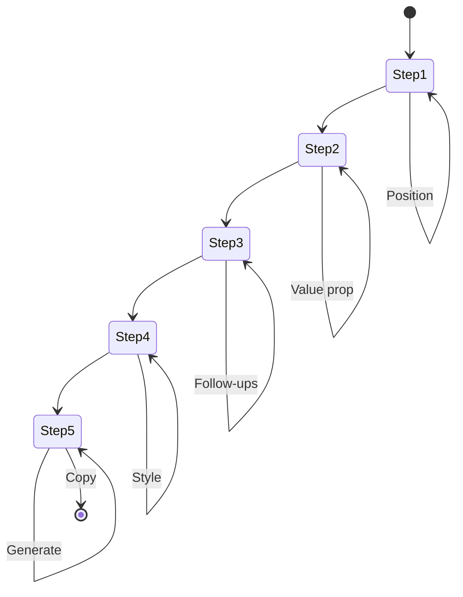

# B2B Cold Email Sequence - Architecture

## 1. Project Structure

```
src/features/cold-email/
├── steps/
│   ├── recipient-position-step.tsx  # Step 1: Recipient Position selection
│   ├── core-value-prop-step.tsx     # Step 2: Core Value Prop selection
│   ├── number-of-followups-step.tsx # Step 3: Number of Follow-ups selection
│   ├── persuasion-style-step.tsx    # Step 4: Persuasion Style selection
│   └── output-step.tsx              # Step 5: Output/Generate
├── store/
│   └── useWizardStore.ts            # Zustand global state
├── types/
│   └── wizard.ts                    # TypeScript interfaces
└── utils/
    ├── dictionary.ts                # UI value to email template mappings
    └── markdown-generator.ts        # Template literal engine
```

---

## 2. State Flow

```
                    Zustand Wizard Store
  selections: {
    recipientPosition: "ceo-founder" | "hr-manager" | "cmo-marketing" | "cto-it",
    coreValueProp: "cost-savings" | "revenue-increase" | "time-savings" | "automation",
    numberOfFollowups: "just-1-email" | "3-email-sequence" | "5-email-sequence",
    persuasionStyle: "direct" | "storytelling" | "data-case-study"
  }
                    |
        +-----------+-----------+
        v                       v
  Navigation              Step Components
                            |
                            v
                    Step 5: Output Step
              generatePrompt() -> email sequence
```

---

## 3. Mermaid State Diagram



---

## 4. File Responsibilities

| File | Responsibility |
|------|----------------|
| useWizardStore.ts | Global state, selections, navigation, generation |
| dictionary.ts | Maps to email templates, subject lines, body copy |
| markdown-generator.ts | Builds multi-email sequences |
| step-*.tsx | Individual step UI |
