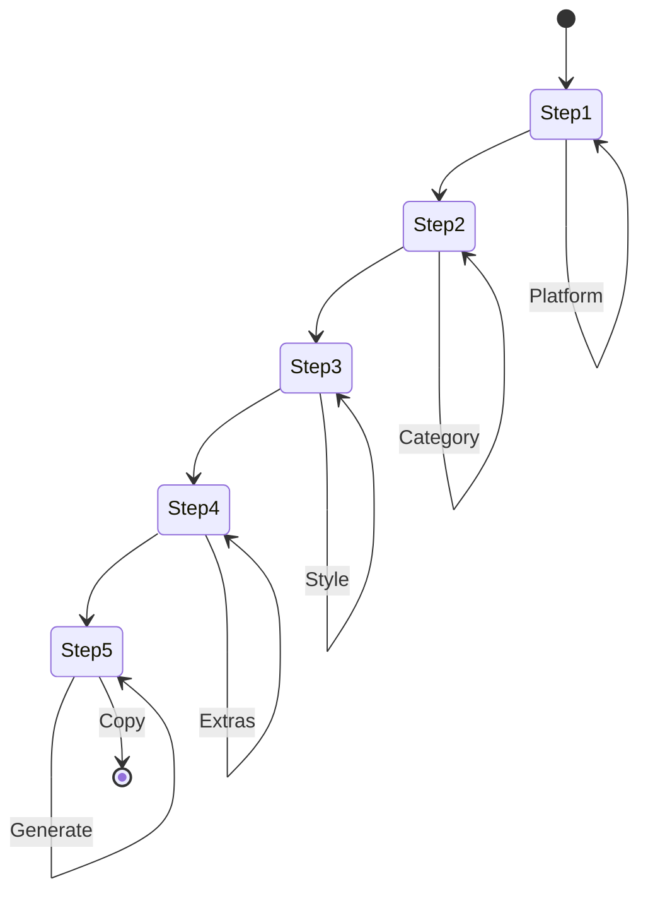

# E-Commerce Listing Copywriter - Architecture

## 1. Project Structure

```
src/features/ecommerce-listing/
├── steps/
│   ├── selling-platform-step.tsx    # Step 1: Selling Platform selection
│   ├── product-category-step.tsx    # Step 2: Product Category selection
│   ├── copywriting-style-step.tsx   # Step 3: Copywriting Style selection
│   ├── extra-elements-step.tsx      # Step 4: Extra Elements selection
│   └── output-step.tsx              # Step 5: Output/Generate
├── store/
│   └── useWizardStore.ts            # Zustand global state
├── types/
│   └── wizard.ts                    # TypeScript interfaces
└── utils/
    ├── dictionary.ts                # UI value to listing template mappings
    └── markdown-generator.ts        # Template literal engine
```

---

## 2. State Flow

```
                    Zustand Wizard Store
  selections: {
    sellingPlatform: "shopify" | "amazon" | "instagram-shop" | "local-marketplace",
    productCategory: "fashion" | "electronics" | "skincare-beauty" | "food-beverage",
    copywritingStyle: "hard-sell-discount" | "soft-sell-benefit" | "luxury-premium",
    extraElements: ["feature-bullets", "how-to-guide", "faq", "warranty-info"]
  }
                    |
        +-----------+-----------+
        v                       v
  Navigation              Step Components
                            |
                            v
                    Step 5: Output Step
              generatePrompt() -> product listing
```

---

## 3. Mermaid State Diagram



---

## 4. File Responsibilities

| File | Responsibility |
|------|----------------|
| useWizardStore.ts | Global state, selections, navigation, generation |
| dictionary.ts | Maps to listing templates, category keywords, style guides |
| markdown-generator.ts | Builds full product listing with sections |
| step-*.tsx | Individual step UI |
