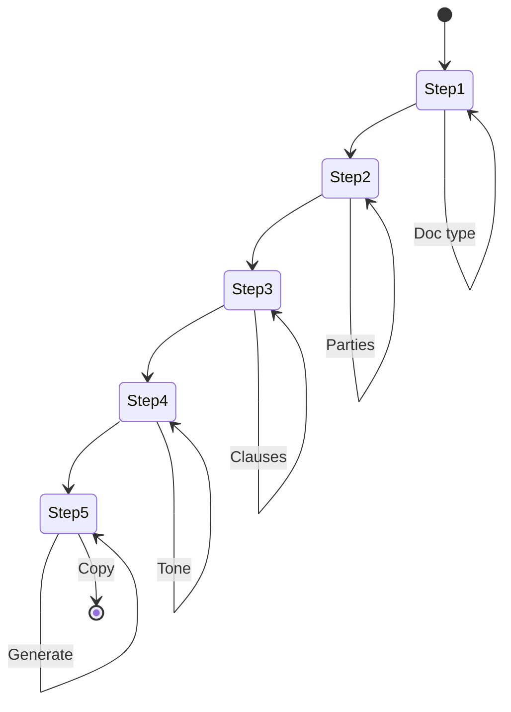

# Legal Document Draft Builder - Architecture

## 1. Project Structure

```
src/features/legal-draft/
├── steps/
│   ├── document-type-step.tsx      # Step 1: Document Type selection
│   ├── involved-parties-step.tsx   # Step 2: Involved Parties selection
│   ├── special-clauses-step.tsx    # Step 3: Special Clauses selection
│   ├── tone-step.tsx               # Step 4: Tone selection
│   └── output-step.tsx             # Step 5: Output/Generate
├── store/
│   └── useWizardStore.ts           # Zustand global state
├── types/
│   └── wizard.ts                   # TypeScript interfaces
└── utils/
    ├── dictionary.ts               # UI value to legal clause mappings
    └── markdown-generator.ts       # Template literal engine
```

---

## 2. State Flow

```
                    Zustand Wizard Store
  selections: {
    documentType: "nda" | "freelance-contract" | "tos" | "privacy-policy",
    involvedParties: "company-b2b" | "individual-b2c" | "independent-contractor",
    specialClauses: ["ip-rights", "late-payment", "limited-revisions"],
    tone: "strict-binding" | "user-friendly-approachable"
  }
                    |
        +-----------+-----------+
        v                       v
  Navigation              Step Components
                            |
                            v
                    Step 5: Output Step
              generatePrompt() -> legal document
```

---

## 3. Mermaid State Diagram



---

## 4. File Responsibilities

| File | Responsibility |
|------|----------------|
| useWizardStore.ts | Global state, selections, navigation, generation |
| dictionary.ts | Maps to legal templates, clause language |
| markdown-generator.ts | Builds legal document with proper sections |
| step-*.tsx | Individual step UI |
