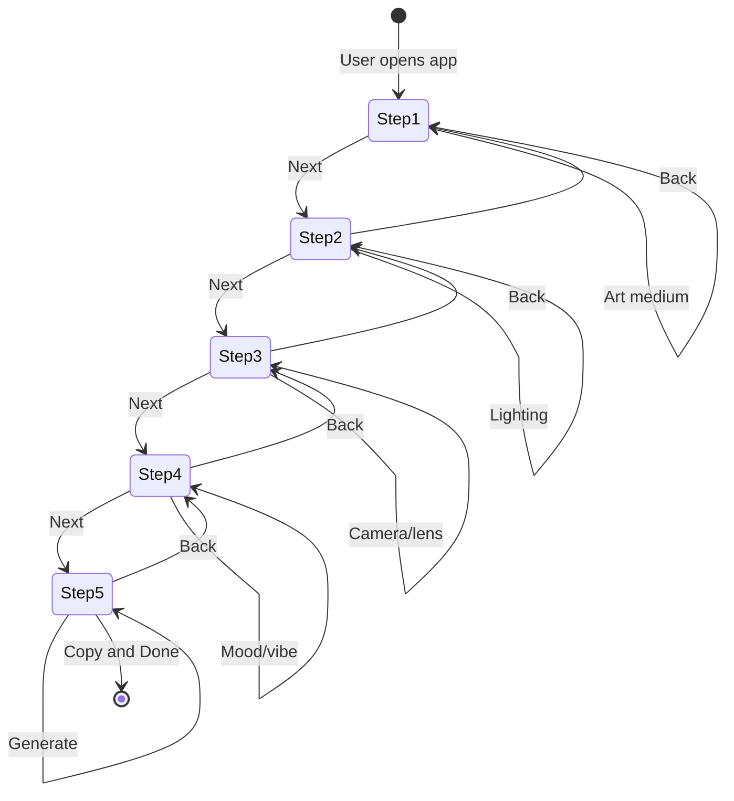

# Midjourney Prompt Builder - Architecture

## 1. Project Structure

```
src/features/midjourney/
├── steps/
│   ├── art-medium-step.tsx         # Step 1: Art Medium selection
│   ├── lighting-step.tsx           # Step 2: Lighting selection
│   ├── camera-lens-step.tsx        # Step 3: Camera and Lens selection
│   ├── mood-vibe-step.tsx          # Step 4: Mood/Vibe selection
│   └── output-step.tsx             # Step 5: Output/Generate
├── store/
│   └── useWizardStore.ts           # Zustand global state
├── types/
│   └── wizard.ts                   # TypeScript interfaces
└── utils/
    ├── dictionary.ts               # UI value to Midjourney parameter mappings
    └── markdown-generator.ts       # Template literal engine
```

---

## 2. State Flow

```
                    Zustand Wizard Store
  selections: {
    artMedium: "photorealistic" | "3d-render" | "anime" | "watercolor" | "flat-vector",
    lighting: "cinematic" | "golden-hour" | "studio-lighting" | "cyberpunk-neon",
    cameraLens: "drone-shot" | "macro-lens" | "fisheye" | "35mm-film",
    moodVibe: "dramatic" | "peaceful" | "eerie" | "cheerful"
  }
                    |
        +-----------+-----------+
        v                       v
  Navigation              Step Components (1-4)
                            |
                            v
                    Step 5: Output Step
              generatePrompt() -> Midjourney prompt
```

---

## 3. Mermaid State Diagram



---

## 4. File Responsibilities

| File | Responsibility |
|------|----------------|
| useWizardStore.ts | Global state, selections, navigation, generation |
| dictionary.ts | Maps UI values to Midjourney style parameters |
| markdown-generator.ts | Builds Midjourney prompt with --ar, --v flags |
| wizard-shell.tsx | Layout, stepper, dynamic rendering |
| step-*.tsx | Individual step UI |
