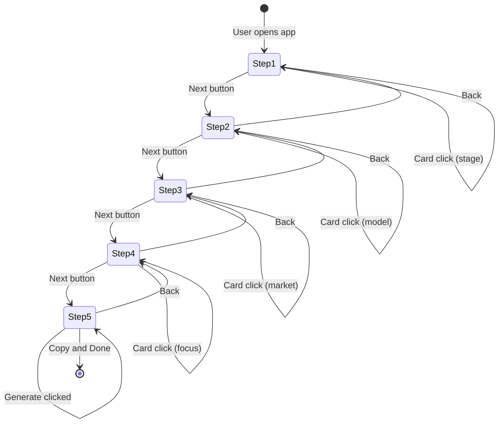

# Pitch Deck Architect - Architecture

## 1. Project Structure

```
src/features/pitch-deck/
├── steps/
│   ├── business-stage-step.tsx     # Step 1: Business Stage selection
│   ├── business-model-step.tsx     # Step 2: Business Model selection
│   ├── target-market-step.tsx      # Step 3: Target Market selection
│   ├── pitch-focus-step.tsx        # Step 4: Pitch Focus selection
│   └── output-step.tsx             # Step 5: Output/Generate
├── store/
│   └── useWizardStore.ts           # Zustand global state
├── types/
│   └── wizard.ts                   # TypeScript interfaces
└── utils/
    ├── dictionary.ts               # UI value to instruction mappings
    └── markdown-generator.ts       # Template literal engine
```

---

## 2. State Flow

```
                    Zustand Wizard Store
  selections: {
    businessStage: "ideation" | "pre-seed" | "seed" | "series-a",
    businessModel: "b2b-saas" | "marketplace" | "freemium-b2c" | "subscription",
    targetMarket: "gen-z" | "enterprise-b2b" | "smbs" | "mass-market",
    pitchFocus: "seeking-investors" | "competition" | "internal-alignment"
  }
                    |
        +-----------+-----------+
        v                       v
  Navigation              Step Components (1-4)
                            |
                            v
                    Step 5: Output Step
              generatePrompt() -> deck outline
```

---

## 3. Mermaid State Diagram



---

## 4. File Responsibilities

| File | Responsibility |
|------|----------------|
| useWizardStore.ts | Global state, selections, navigation, generation |
| dictionary.ts | Maps UI values to pitch deck instructions |
| markdown-generator.ts | Builds full pitch deck outline in Markdown |
| wizard-shell.tsx | Layout, stepper, dynamic rendering |
| step-*.tsx | Individual step UI |
