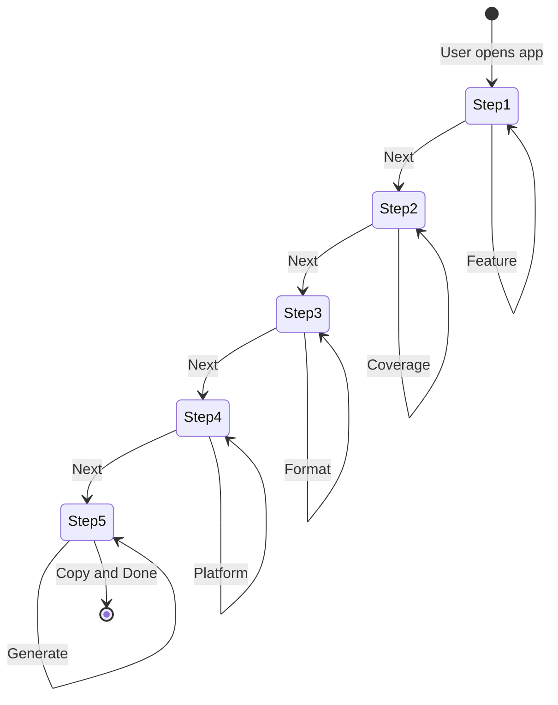

# QA Edge-Case Planner - Architecture

## 1. Project Structure

```
src/features/qa-planner/
├── steps/
│   ├── feature-to-test-step.tsx    # Step 1: Feature selection
│   ├── test-coverage-step.tsx      # Step 2: Test Coverage selection
│   ├── output-format-step.tsx      # Step 3: Output Format selection
│   ├── platform-target-step.tsx    # Step 4: Platform Target selection
│   └── output-step.tsx             # Step 5: Output/Generate
├── store/
│   └── useWizardStore.ts           # Zustand global state
├── types/
│   └── wizard.ts                   # TypeScript interfaces
└── utils/
    ├── dictionary.ts               # UI value to test instruction mappings
    └── markdown-generator.ts       # Template literal engine
```

---

## 2. State Flow

```
                    Zustand Wizard Store
  selections: {
    featureToTest: "login-register" | "payment-checkout" | ...,
    testCoverage: "happy-path" | "edge-cases" | "accessibility" | ...,
    outputFormat: "gherkin" | "manual-checklist" | "jest-cypress",
    platformTarget: "desktop-web" | "mobile-web" | "native-app" | "api"
  }
                    |
        +-----------+-----------+
        v                       v
  Navigation              Step Components
                            |
                            v
                    Step 5: Output Step
              generatePrompt() -> test plan
```

---

## 3. Mermaid State Diagram



---

## 4. File Responsibilities

| File | Responsibility |
|------|----------------|
| useWizardStore.ts | Global state, selections, navigation, generation |
| dictionary.ts | Maps to test scenarios, assertions, platform configs |
| markdown-generator.ts | Builds test cases in selected format |
| step-*.tsx | Individual step UI |
