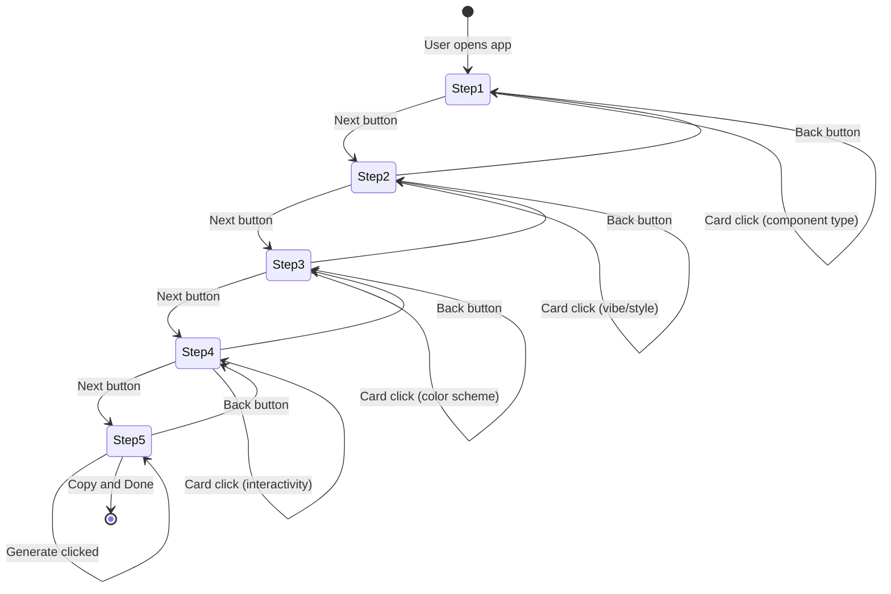

# UI-UX Component Prompt Builder - Architecture

## 1. Project Structure

```
src/features/ui-ux-component/
├── steps/
│   ├── component-type-step.tsx     # Step 1: Component Type selection
│   ├── vibe-style-step.tsx         # Step 2: Vibe and Style selection
│   ├── color-scheme-step.tsx       # Step 3: Color Scheme selection
│   ├── interactivity-step.tsx      # Step 4: Interactivity selection
│   └── output-step.tsx             # Step 5: Output/Generate
├── store/
│   └── useWizardStore.ts           # Zustand global state
├── types/
│   └── wizard.ts                   # TypeScript interfaces
└── utils/
    ├── dictionary.ts               # UI value to instruction mappings
    └── markdown-generator.ts       # Template literal engine
```

---

## 2. State Flow Diagram

```
                    Zustand Wizard Store
  selections: {
    componentType: "landing-hero" | "pricing-table" | ...,
    vibeStyle: "minimalist" | "neo-brutalism" | ...,
    colorScheme: "monochrome" | "pastel" | "vibrant" | ...,
    interactivity: "static" | "hover-animations" | ...
  }
                    |
        +-----------+-----------+
        v                       v
  Navigation              Step Components
  nextStep/prevStep       (1-4: read-only)
                                |
                                v
                    Step 5: Output Step
        generatePrompt() -> markdownGenerator()
```

---

## 3. Data Flow (Step-by-Step)

### 3.1 User Selection Flow
```
User clicks card
    v
SelectableCard onSelect(id) fires
    v
Step component calls updateSelection()
    v
Zustand store updates selections object
    v
All subscribed components re-render
```

### 3.2 Markdown Generation Flow
```
User clicks "Generate Prompt" on Step 5
    v
generatePrompt() called in store
    v
Template literal in markdown-generator.ts
    v
Dictionary lookups for each selection
    v
Full component prompt Markdown assembled
    v
Textarea displays result
```

---

## 4. Mermaid State Diagram



---

## 5. File Responsibilities

| File | Responsibility |
|------|----------------|
| useWizardStore.ts | Global state, selections, navigation, generation trigger |
| dictionary.ts | Maps UI values to detailed component instructions |
| markdown-generator.ts | Template literal function to build component prompt |
| wizard-shell.tsx | Layout, stepper, dynamic step rendering |
| selectable-card.tsx | Reusable card with single/multiple modes |
| step-*.tsx | Individual step UI, calls store updates |
