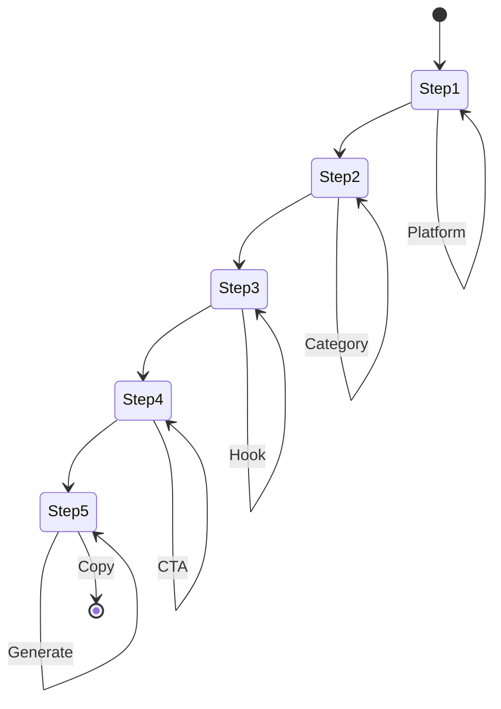

# Viral Video Script Generator - Architecture

## 1. Project Structure

```
src/features/video-script/
├── steps/
│   ├── main-platform-step.tsx      # Step 1: Main Platform selection
│   ├── content-category-step.tsx   # Step 2: Content Category selection
│   ├── hook-strategy-step.tsx      # Step 3: Hook Strategy selection
│   ├── cta-step.tsx                # Step 4: CTA selection
│   └── output-step.tsx             # Step 5: Output/Generate
├── store/
│   └── useWizardStore.ts           # Zustand global state
├── types/
│   └── wizard.ts                   # TypeScript interfaces
└── utils/
    ├── dictionary.ts               # UI value to script instruction mappings
    └── markdown-generator.ts       # Template literal engine
```

---

## 2. State Flow

```
                    Zustand Wizard Store
  selections: {
    mainPlatform: "tiktok" | "instagram-reels" | "youtube-long" | "youtube-shorts",
    contentCategory: "educational" | "entertainment" | "product-review" | ...,
    hookStrategy: "curiosity-gap" | "surprising-fact" | "controversial" | "relatable",
    cta: "like-follow" | "click-link" | "watch-part-2"
  }
                    |
        +-----------+-----------+
        v                       v
  Navigation              Step Components
                            |
                            v
                    Step 5: Output Step
              generatePrompt() -> video script
```

---

## 3. Mermaid State Diagram



---

## 4. File Responsibilities

| File | Responsibility |
|------|----------------|
| useWizardStore.ts | Global state, selections, navigation, generation |
| dictionary.ts | Maps to video script templates and platform specs |
| markdown-generator.ts | Builds full video script with timing cues |
| step-*.tsx | Individual step UI |
